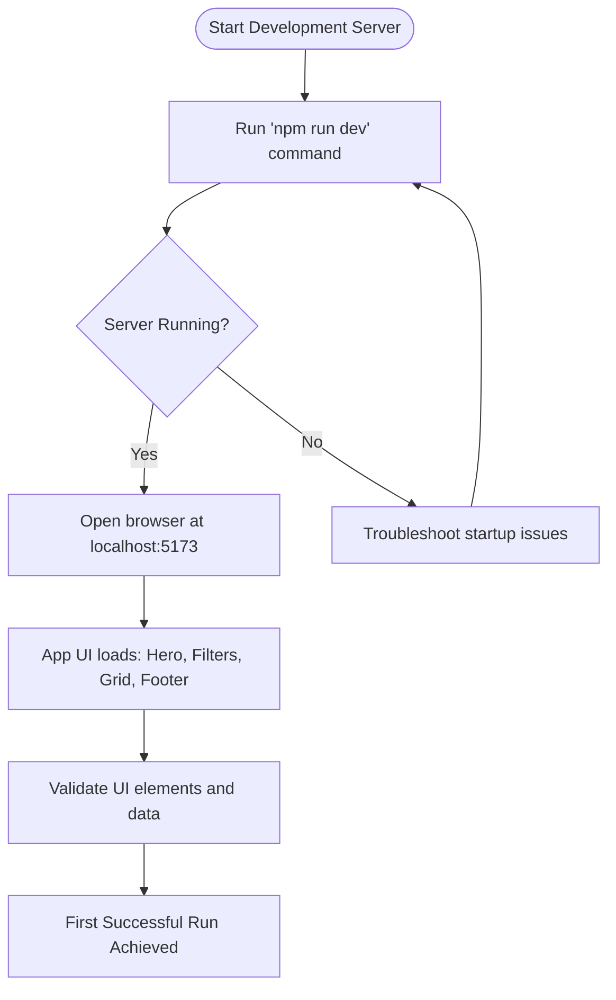

# Your First Successful Run

Welcome to your first interaction with the **Y Combinator Graveyard Stories** application! This guide walks you through starting the development server, understanding what a successful launch looks like, what you should see next, and how to validate that the application is running correctly.

By following this guide, you will confidently bring the app to life locally and ensure all core parts are working as expected.

---

## 1. Starting the Development Server

To launch the application locally and view the data-driven UI showcasing failed YC startups, follow these steps:

### Step 1: Open a Terminal

Begin by opening your terminal or command line interface in the root folder of the project.

### Step 2: Run the Development Command

Execute the following command to start the development server:

```bash
npm run dev
```

- This script launches Vite, a fast development server, which hosts the app locally.
- You will see output indicating the server has started, including a local address (usually `http://localhost:5173` or similar).

### Step 3: Wait for Server Startup Confirmation

Look for a message similar to:

```plain
  vite vX.X.X dev server running at:

  > Local:    http://localhost:5173/
  > Network:  use `--host` to expose
```

This confirms your app is now running locally and ready to be accessed.

<Check>
If the terminal shows errors during startup, ensure all dependencies are installed (`npm install`) and that no other services are using the same port.
</Check>

## 2. Previewing the Application Interface

Once the development server is running:

- Open your web browser.
- Navigate to the local address provided (e.g., `http://localhost:5173`).

You should see the main UI, structured as follows:

- **Hero Section** at the top featuring summary statistics like number of failed companies, total funding lost, and average years active.
- **Filters Section** below the hero allows you to search companies by name, category, and batch.
- **Company Grid** displaying cards for each failed YC company matching your current filter settings.
- **Footer** with branding and additional info.

<Tip>
If the page appears blank or incomplete, confirm JavaScript is enabled and that the server is running without errors. Refreshing the browser can clear transient issues.
</Tip>

## 3. Essential Checkpoints to Validate Your First Run

Make sure your first successful run includes these checkpoints:

### 3.1 Hero Section Displays Correct Summaries

- Number of failed companies should match the dataset count (over 260 companies).
- Total funding lost should appear as a formatted billion-dollar amount (e.g., “$3.2B”).
- Average years active should be a decimal number (for example, “5.4”).

### 3.2 Filters Section Is Interactive

- Search box accepts text input.
- Category and batch dropdowns list available options and include an "all" option.
- Filter adjustment immediately updates the displayed companies.

### 3.3 Company Grid Shows Results

- The grid populates with company cards.
- Each card displays company name, batch, description, category, founded/shutdown years, funding amount, and reason for shutdown.
- If no results match your filters, a "No companies found" message appears with friendly guidance.

### 3.4 No Console Errors in Browser

Open your browser developer tools and ensure no JavaScript or network errors appear. Clean console output is a sign the app and data are loading correctly.

## 4. Understanding What’s Happening Behind the Scenes

Here’s a quick narrative of the flow that brings the app to life:

- The app loads all data on failed YC companies ranging from 2005 to 2025.
- Filters, search terms, and category/batch selections dynamically filter this dataset.
- The filtered results display as individual cards on the grid.
- Summary metrics update based on the full dataset.

This flow enables you to explore, analyze, and learn from the history of these startups with intuitive, human-friendly tools.

## 5. Troubleshooting Common Issues

If you encounter hiccups along the way, try these troubleshooting tips:

<AccordionGroup title="Troubleshooting Your First Run">
<Accordion title="Development Server Won't Start">
- Confirm Node.js version meets requirements (usually 16.x or higher).
- Run `npm install` to ensure dependencies are present.
- Check if the port 5173 is already in use; if yes, stop conflicting services or change Vite’s port in the config.
</Accordion>
<Accordion title="Browser Shows Blank Page or Partial UI">
- Ensure you navigated to the correct localhost URL.
- Reload and clear cache.
- Check browser console for JavaScript errors and report them.
- Confirm no ad-blockers or extensions are interfering.
</Accordion>
<Accordion title="Filter Controls Do Not Update Results">
- Verify state updates in the filters trigger re-rendering.
- Restart development server to clear any stale cache.
- Refresh page to reset UI state.
</Accordion>
</AccordionGroup>

## 6. Next Steps

Congratulations! Your application is up and running. To deepen your familiarity:

- Experiment with filter combinations and searches to see how the data behaves.
- Explore the [Basic Configuration guide](/getting-started/first-run-config/basic-configuration) to customize app settings like ports and environment variables.
- Visit [Troubleshooting Common Setup Issues](/getting-started/first-run-config/troubleshooting-basics) if you face persistent problems.
- Review the [Quick Feature Overview](/overview/architecture-core-concepts/quick-feature-overview) to understand key interactions.

Keep exploring to leverage all insights the YC Dead Pool offers!

---

## Summary Diagram of First Run Flow



---

## Additional Resources

- [Prerequisites & System Requirements](/getting-started/setup-installation/prerequisites) 
- [Installation Methods](/getting-started/setup-installation/installation-methods)
- [Basic Configuration](/getting-started/first-run-config/basic-configuration)
- [Troubleshooting Common Setup Issues](/getting-started/first-run-config/troubleshooting-basics)
- [Quick Feature Overview](/overview/architecture-core-concepts/quick-feature-overview)

These will help you prepare your environment, install confidently, configure precisely, and trouble-shoot effectively.


---

<Tip>
Remember, the heart of this application is exploring the fascinating tales of YC startups that didn’t make it — your first step is simply getting this rich experience running smoothly on your machine.
</Tip>

You’re now ready to start your journey with Y Combinator Graveyard Stories.

---

*End of guide.*
