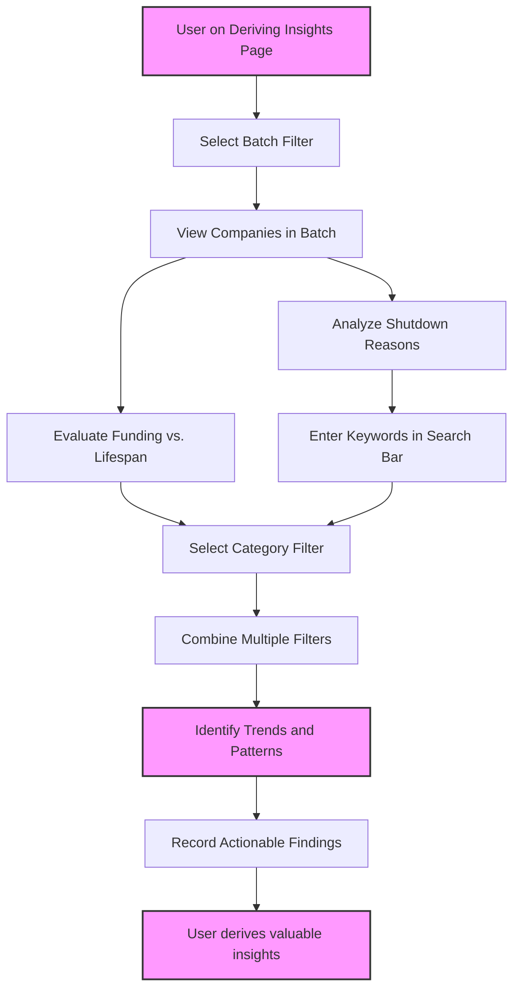

# Deriving Insights from Dataset Trends

Unlocking the stories behind failed startups requires more than just browsing their details — it calls for a methodical approach to identifying trends and actionable patterns in the dataset. This guide empowers you to read between the lines of the Y Combinator Graveyard Stories dataset by analyzing failures across batches, funding, shutdown reasons, and categories.

---

## 1. Understanding the Purpose of This Page

### What You Will Learn
- How to interpret startup failure trends by filtering companies by batch, funding amount, shutdown reasons, and other attributes.
- Practical methods to spot meaningful data patterns that highlight collective insights rather than isolated cases.
- Techniques to extract actionable conclusions for investors, founders, and researchers interested in startup ecosystem dynamics.

### Prerequisites
- Familiarity with the Y Combinator Graveyard Stories web app interface.
- Basic knowledge of navigating filters by name, category, and batch as covered in the 'Filtering and Searching for Companies' guide.
- Access to the dataset via the web interface or any local copy of the data.

### Expected Outcome
By following this guide, you will confidently identify dataset trends such as recurring failure reasons within batches, funding thresholds that correlate with shorter company lifespans, or specific sectors prone to shutdowns. You'll turn raw data into insights that guide decision-making or hypothesis formulation.

---

## 2. Analyzing Data Trends: Step-by-Step Workflow

### Step 1: Start with Batch-Based Grouping

The dataset categorizes companies by YC batch codes (e.g., W20, S21). Companies in the same batch share a temporal context and sometimes entrepreneurial climate or economic conditions.

**How to Proceed:**
1. Use the batch filter dropdown to select a specific batch (e.g., `W20`).
2. Observe the companies listed and note common shutdown reasons or sectors.
3. Compare the total funding and average years active for that batch displayed in the Hero Section.

**What You Should See:**
- A focused list of companies from that batch.
- Key metrics like total funding lost and average lifespan summarized.

**Example:**
- Selecting batch `W20` shows companies like Quibi and Clubhouse, highlighting trends in entertainment and social media failures during 2020.

---

### Step 2: Examine Funding Levels vs. Lifespan

Funding amounts offer insight into both risk appetite and operational scale, while lifespan relates to survival time.

**How to Proceed:**
1. Review companies with exceptionally high or low funding by sorting/filtering externally or visually scanning the Company Cards.
2. Cross-reference these with the `Founded - ShutdownYear` timeline in the card description.
3. Look for correlations: Did higher funding lead to longer lifespan? Or were highly funded companies shut down quickly?

**Tip:** The funding figures (e.g., "$1750M") are parsed and calculated internally to produce total funding lost and average years active metrics.

**Example:**
- Peloton Interactive raised $2200M but lasted ~4 years post-founding, indicating significant funding doesn't guarantee survival.

---

### Step 3: Identify Common Shutdown Reasons

Reading shutdown reasons uncovers thematic patterns beyond numbers — market mismatch, overambition, competition, or timing.

**How to Proceed:**
1. Use the search bar to enter keywords related to failure causes such as "competition", "COVID", "pricing", or "technology".
2. Filter categories such as "AI", "Social Media", or "E-commerce" to spot sector-specific issues.
3. Scan the company reason descriptions for repeated phrases or outlooks.

**What You Should See:**
- Clusters of companies failing for similar issues.
- Examples of specific causes impacting multiple companies.

**Example:**
- Several AI startups in batch `W23` note challenges like "open source models made their offering pointless" or "GPT-4 made specialized AI obsolete".

---

### Step 4: Explore Category-Specific Trends

Categories organize companies by product domain and market.

**How to Proceed:**
1. Use the Category filter to focus on a sector (e.g., "Gaming", "Social Media").
2. Observe the frequency and distribution of shutdowns across batches within that sector.
3. Note if particular categories tend to fail faster or with lower funding.

**Example:**
- In "Gaming", multiple platforms like Stadia and Netflix Games show shortened lifespans, often due to fierce competition.

---

### Step 5: Combine Filters for Deeper Insights

Use combined filters — batch + category, or category + funding keyword in search — to narrow down insights on niche conditions.

**How to Proceed:**
1. Start with a batch filter.
2. Add category filtering.
3. Input relevant keywords in the search bar.

**Result:**
- A highly focused list showing trends like "clean energy failures in the 2012–2017 batches due to high installation costs and low adoption".

---

## 3. Practical Examples

### Example 1: Discovering AI Startup Trends

- Select batch "W23".
- Filter category to "AI".
- Review shutdown reasons — many mention emerging open source competition and ethical constraints.
- Total funding and lifespan in Hero Section highlight substantial investment but brief survival.

### Example 2: Understanding the Decline of 10-Minute Delivery Services

- Search for "10-minute delivery".
- Filter category "Delivery".
- Observe several companies (e.g., "Gorillas", "Getir") with shutdown reasons highlighting unsustainable unit economics.

### Example 3: Tracking Social Media Failures Across Batches

- Filter by category "Social Media".
- Observe failures spanning 2005 through 2024.
- Note how the reasons evolve from "competition with established giants" to "user preference shifts" and "platform clutter".

---

## 4. Troubleshooting Common Challenges

<AccordionGroup title="Troubleshooting Tips for Data Trend Analysis">
<Accordion title="Filtered Results Show No Companies">
If no companies appear, confirm your filters are not overly restrictive. Reset one or more filters to 'All' or clear the search term to broaden results.
</Accordion>
<Accordion title="Funding or Lifespan Data Seems Unrealistic">
Remember, funding is parsed from string amounts with symbols and may round totals. Lifespan is calculated as shutdownYear minus founded year.
Extremely short or zero-year lifespans reflect immediate failures.
</Accordion>
<Accordion title="Unable to Identify Patterns in Shutdown Reasons">
Use general keywords and gradually refine search terms. The dataset includes informal and humorous shutdown descriptions, so focus on core thematic words.
</Accordion>
</AccordionGroup>

---

## 5. Best Practices for Extracting Insights

- **Start Broad, Then Narrow:** Begin with high-level batch or category filters before layering more specific criteria.
- **Use Multiple Attributes:** Combine funding, lifespan, and shutdown reasons rather than relying on one dimension.
- **Validate Observations:** Cross-reference repeated patterns across batches and categories for reliability.
- **Note Outliers:** Investigate companies with anomalous funding or lifespan for unique insights.
- **Keep Context in Mind:** Understand external factors like market shifts, technology changes, or economic events that affect batches collectively.

---

## 6. Next Steps & Related Content

- For foundational understanding, visit the [Browsing YC Graveyard Stories](https://docs.example.com/guides/core-workflows/browse-companies) guide.
- To master the app filter interface, see [Filtering and Searching for Companies](https://docs.example.com/guides/core-workflows/filter-search).
- Learn to interpret individual company cards in the [Understanding Company Shutdowns](https://docs.example.com/guides/core-workflows/reading-stories) guide.
- Explore product overview and target audience documentation to understand the why and who behind the dataset.

---

## Appendix: Visualizing the Data Flow for Trend Derivation

This diagram illustrates the flow of user actions and data interactions facilitating the discovery of insights from the dataset.

---

You are now equipped to use Y Combinator Graveyard Stories not just as a static reference, but as a dynamic lens into understanding startup failure trends and their stories.

Explore boldly, analyze deeply, and let the data guide your next entrepreneurial or research journey.

---

<Check>
Remember: Patterns emerge through thoughtful filtration and comparison. Avoid drawing conclusions from single data points — trends come from collective evidence.
</Check>
