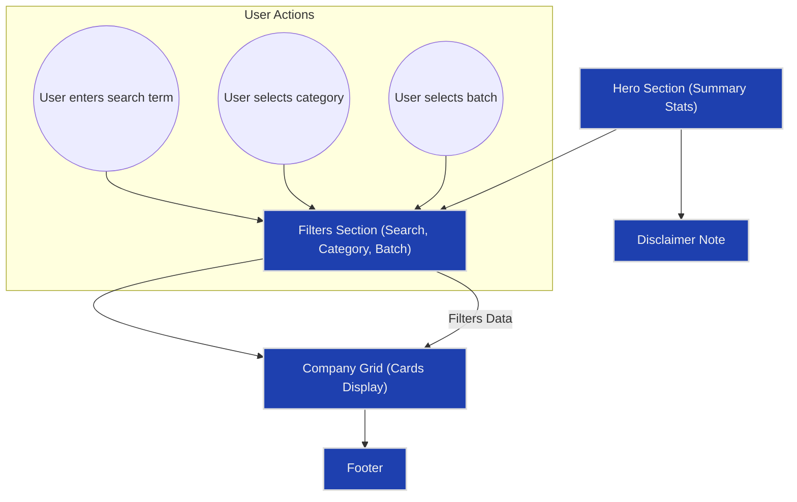

# Browsing YC Graveyard Stories

Explore the landing page of the YC Graveyard Stories app to understand the layout, the company grid, and the overview statistical insights it offers. This guide provides a practical walkthrough of each section so you can efficiently browse through the dataset of failed Y Combinator companies.

---

## 1. Workflow Overview

### Task Description
This guide helps you navigate the YC Graveyard Stories landing page, understand how to use the company grid for browsing, and grasp the summarized statistics displayed prominently. It enables you to start exploring startup failure stories immediately by familiarizing yourself with key UI elements and data summaries.

### Prerequisites
- Access to the YC Graveyard Stories app homepage.
- Basic understanding of Y Combinator batches and startup-related terminology is helpful but not required.

### Expected Outcome
- You will confidently navigate the homepage.
- Understand what the hero statistics represent.
- Efficiently browse and interpret the company grid.
- Know the purpose of additional UI sections like search filters and disclaimers.

### Time Estimate
5 to 10 minutes to get familiar with and start exploring.

### Difficulty Level
Beginner

---

## 2. Understanding the Landing Page Layout

### Hero Section: Your Starting Point
The top section, called the Hero Section, showcases key numbers designed to catch your eye and provide immediate insight:

- **Failed Companies**: Total count of companies listed.
- **Total Funding Lost**: Aggregated funding amount invested across all failed companies, displayed succinctly in billions.
- **Avg Years Active**: Average lifespan of these companies in years.

These statistics give you a quick sense of the scope and impact of the failures documented.

### The Company Grid: Your Browsing Hub
Below the filters, you'll find the Company Grid presenting individual company cards that summarize key data points:

- **Company Name and Batch**: Identifies the company and its Y Combinator batch.
- **Description**: Brief snapshot of what the company did.
- **Category**: Industry or sector of the startup.
- **Years Active and Funding**: Span from founding year to shutdown year and total capital raised.
- **Shutdown Reason**: A concise explanation of why the company failed.

You can scroll through these cards to get a visual sense of trends and individual stories.

### Filters and Search: Refining Your View
Above the grid, the Filters Section allows you to narrow down companies based on:

- **Search Term**: Match against company name, description, or shutdown reason.
- **Category**: Select a specific industry.
- **Batch**: Choose a particular YC batch year.

Each filter updates the grid in real-time, showing the number of results found.

### Informational Disclaimer
A transparent note below the Hero Section warns about potential inaccuracies — an important reminder that this data is for educational and entertainment purposes, reflecting the uncertain origins of the dataset.

### Footer
The footer contains copyright or additional links, maintaining a consistent app structure.

---

## 3. Step-by-Step Guide to Browsing

<Steps>
<Step title="Open the YC Graveyard Stories Homepage">
Navigate to the landing page URL where the full dataset and UI components are presented.
</Step>
<Step title="Review the Hero Section Metrics">
Take in the total number of failed companies, the total funding lost (displayed in billions of dollars), and the average active years. These figures orient you on the dataset’s scale.
</Step>
<Step title="Use the Search Box">
Type keywords related to startup names or failure causes into the search input. For example, searching 'chat' filters all companies linked to chat or communication.
</Step>
<Step title="Filter by Category">
Select a category from the dropdown (e.g., ‘Entertainment’, ‘Social Media’). This restricts the shown companies to just that sector.
</Step>
<Step title="Select a Batch">
Choose a batch (like ‘S05’, ‘W20’, etc.) to focus on startups from a particular YC cohort.
</Step>
<Step title="Browse the Company Grid">
Scroll through the filtered cards. Each card displays essential company info and the reason for shutdown.
</Step>
<Step title="Identify Interesting Companies for Deeper Exploration">
Spot startups that intrigue you based on their descriptions and reasons for failure. Use this as a springboard for further research or reading.
</Step>
</Steps>

---

## 4. Practical Examples

### Example 1: Finding Entertainment Startups from Batch S08
1. In the Category filter, select 'Entertainment'.
2. In the Batch filter, select ‘S08’. 
3. Observe the Company Grid update to show companies like 'Rdio' or 'Biographicon'.
4. Review their descriptions and shutdown reasons to understand their failures.

### Example 2: Searching for Companies with 'AI' in Description or Name
1. Enter the term 'AI' in the search box.
2. The grid will filter dynamically, bringing up AI-driven startups across various categories and batches.

These techniques empower targeted browsing and discovery.

---

## 5. Tips for Effective Browsing

- **Combine Filters for Precision**: Use search, category, and batch filters together to zero in on companies matching very specific criteria.
- **Watch the Results Count**: The app always shows how many companies match your filters, helping you know when your search is too narrow or broad.
- **Scroll and Scan**: The grid displays cards in a responsive layout for comfortable scanning.
- **Use the Shutdown Reason**: This concise explanation often provides insights or cautionary tales about why startups failed, useful for learning.

## 6. Common Pitfalls & Troubleshooting

- **No Companies Found**: If the grid displays "No companies found," consider loosening your filters or clearing the search term.
- **Misunderstanding Totals**: The total funding and statistics reflect raw sums from the dataset, which may have inconsistent formatting or missing data.
- **Data Accuracy Reminder**: Since the dataset is sourced from Lovable and is humorous in tone, do not take the failure reasons or financials as absolute facts.

<Tip>
If results seem unexpectedly low, verify that the "All Categories" and "All Batches" options are set correctly to avoid over-filtering.
</Tip>

---

## 7. Visualizing the Landing Page Components Interaction

---

## 8. Next Steps & Related Guides

- To learn how to filter companies efficiently, see the [Filtering and Searching for Companies](https://example.com/guides/core-workflows/filter-search) guide.
- For a deeper understanding of reasons startups failed, consult [Understanding Company Shutdowns](https://example.com/guides/core-workflows/reading-stories).
- To familiarize yourself with the broader product aims and use cases, review the [Target Audience & Use Cases](https://example.com/overview/getting-started-intro/value-use-cases) page.

---

## References
- [YC Graveyard Stories Homepage Source](src/pages/Index.tsx)
- [useCompanyData Hook Implementation](src/hooks/useCompanyData.ts)
- [CompanyGrid and CompanyCard Components](src/components/CompanyGrid.tsx, src/components/CompanyCard.tsx)
- [FiltersSection Component](src/components/FiltersSection.tsx)
- [HeroSection Component](src/components/HeroSection.tsx)

---

This guide is your gateway to discovering valuable insights wrapped in the stories of failed startups. Use it to navigate confidently and learn wisely.
