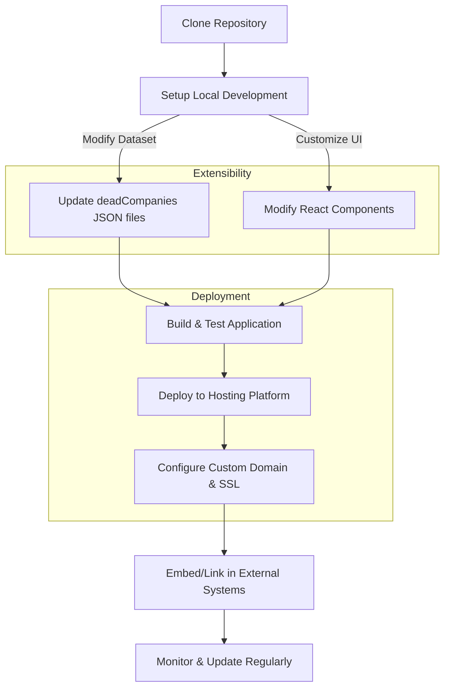

# Integrations & Extensibility

Unlock the full potential of Y Combinator Graveyard Stories by exploring how you can integrate, deploy, and extend the app to fit your unique workflows. This page guides you through deployment options, domain configurations, and how to enhance the app programmatically — including connection points with Lovable and other developer tooling.

---

## Understanding the Role of Integrations & Extensibility

Y Combinator Graveyard Stories shines as an interactive web application spotlighting startup failures. However, your goals might stretch beyond just browsing data — you may want to embed the app in your systems, customize its data, or integrate it into research or investment workflows.

This page shows you exactly _how_ to make that happen while preserving the benefit-driven, user-focused experience.

---

## Deployment Options: Launching Your Version

The app is built as a React-based web application optimized for modern deployment environments. Depending on your needs, you can deploy it:

- **Locally** for development and experimentation. Run the app using your preferred IDE or local server.
- **On a web host or cloud platform** such as Vercel, Netlify, or AWS Amplify for public availability.
- **Within a custom domain** that reflects your brand or research initiative.

### Key Deployment Considerations

- The app requires a Node.js environment to build the React application.
- Static site hosting works seamlessly as the app is a front-end SPA (Single Page Application) consuming bundled JSON data.
- For continuous updates, consider integrating with GitHub and automated deployment pipelines.

---

## Domain Configuration: Making the App Yours

By default, the app runs on localhost or a hosting provider's domain. For professional appearance and easier access:

- **Set up a custom domain:** Point your DNS records to your hosting service.
- **Enable HTTPS:** Ensure encrypted traffic with SSL certificates (free options like Let's Encrypt are recommended).
- **Branding:** Customize title, meta descriptions, and Open Graph tags to reflect your project identity.

This configuration supports sharing the app with your audience confidently, whether investors, founders, or researchers.

---

## Programmatic Extensibility: Tailoring Data and UI

The app’s architecture supports extension through code, enabling you to programmatically augment data or adapt user interface components.

### Extending the Dataset

- The core dataset is managed as JSON arrays within the project (e.g., `deadCompanies2005to2019.ts` and `deadCompanies2020to2025.ts`).
- To add new failure stories or update existing entries, simply edit or append new items based on the `DeadCompany` interface:

```typescript
interface DeadCompany {
  id: number;
  name: string;
  batch: string;
  year: number;
  description: string;
  reason: string;
  category: string;
  founded: number;
  shutdownYear: number;
  funding: string;
}
```

- Ensure new entries follow the data format and field types for consistent filtering and display.

### Customizing the User Interface

- The UI uses React components such as `CompanyGrid`, `CompanyCard`, and `FiltersSection` to render and filter companies.
- You can override or extend these components for:
  - Adding more filter categories or custom filters
  - Changing company card layouts to emphasize different attributes
  - Introducing programmatic interactions (e.g., custom search logic or analytics hooks)

---

## Connecting With Lovable and Other Tooling

This project was scaffolded using Lovable, which offers a streamlined way to generate React apps with rich data handling.

### Starting Points for Integration:

- **Lovable Web Interface:** Use Lovable’s web platform to visually edit and manage your data, then export updates into this codebase.
- **GitHub & Codespaces:** Harness GitHub for source control and VS Code Codespaces for cloud-based development with minimal setup.
- **Data Hooks & Filters:** Leverage hooks like `useCompanyData` that abstract dataset operations, simplifying integration with new data sources or external APIs.

<Tip>
If you want to extend the dataset automatically, consider integrating data ingestion scripts that pull from external databases or APIs, feeding data into the standard JSON format used here.
</Tip>

---

## Integration Workflow Example

Here’s a typical flow to integrate this app into your ecosystem:

1. **Clone the repository** and configure local development or cloud deployment.
2. **Customize the dataset** with new failure stories matching your research focus.
3. **Modify UI components** to highlight specific data points relevant to your users.
4. **Deploy on your custom domain** with SSL enabled.
5. **Embed or link the app** within your internal tools, investor dashboards, or research portals.
6. **Maintain updates** via GitHub and leverage Lovable for new data enrichment.

---

## Practical Tips & Best Practices

- Always validate new or extensible data against the `DeadCompany` type to avoid runtime errors.
- When deploying, use environment variables or config files to set domain-specific information without hardcoding.
- Document any custom UI changes separately to assist future maintainers.
- Test filtering and sorting logic thoroughly after extending datasets, as these directly affect user experience.

<Warning>
Avoid deploying with stale or unverified data; the humor and user trust rely on the accuracy and context of failure stories.
</Warning>

---

## Troubleshooting & Common Pitfalls

- **Issue:** Data not showing after extension.
  - Verify that new entries conform exactly to the `DeadCompany` fields.
  - Check for typos in batch or category strings.
  - Ensure the filtering logic (e.g., `filterCompanies` in `useCompanyData`) covers new categories.

- **Issue:** Deployment fails.
  - Confirm Node.js and npm versions meet build requirements.
  - Review hosting platform logs for errors.
  - Ensure environment variables for domain or API keys are correctly set.

- **Issue:** Custom domain SSL errors.
  - Check DNS records for propagation.
  - Confirm SSL certificate issuance and renewal status.

---

## Visual Overview: Integration & Extensibility Flow



---

## Next Steps

To start integrating and extending:

- Review the [Local Installation & Running with Your IDE](../getting-started/installation-first-run/local-install-dev) guide.
- Explore the [Lovable Web Interface](../getting-started/installation-first-run/web-setup-lovable) for no-code data management.
- Deep dive into UI customization with components like `CompanyCard` and `FiltersSection`.
- Check out the [System Architecture Overview](../overview/architecture-core-concepts/system-architecture) for in-depth knowledge of the app's structure.

By mastering integrations and extensibility, you can transform this curated archive of YC startup failures into a powerful, tailored resource for your community.

---

_START YOUR EXTENSION JOURNEY TODAY AND MAKE STARTUP FAILURE DATA WORK FOR YOU._
