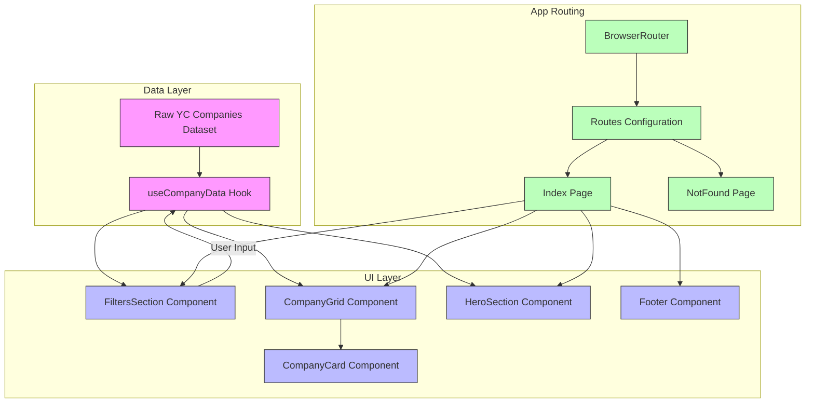

# How the App is Structured

Discover the design and flow of Y Combinator Graveyard Stories. This page provides a clear, illustrated overview of the application’s major components—from data aggregation and filtering to the final user interface—demonstrating how information travels from external sources all the way to your screen.

## Overview

At its core, the app delivers an intuitive experience for exploring a rich dataset of failed YC startups. Behind the scenes, the system orchestrates several key parts working in harmony:

- Data ingestion and aggregation
- User-driven filtering and searching
- Dynamic UI rendering

This structure ensures users find exactly the information they need quickly and seamlessly.

## Data Flow Walkthrough

1. **Raw Data Sources**
   - The app relies on a curated dataset of YC companies—including details like name, funding, failure reasons, and timelines.

2. **Data Access and State Management**
   - Data is loaded into the app’s state using the custom `useCompanyData` hook, which processes the full list of companies, extracting metadata such as all available categories and batches.

3. **Filtering and Searching**
   - Users refine the dataset through interactive controls:
     - Search box to query names, descriptions, and failure reasons
     - Category dropdown to focus on specific industries
     - Batch dropdown to limit by founding cohorts
   - These inputs drive a filtering function that returns a relevant subset dynamically.

4. **UI Components**
   - Filter inputs are rendered in the `FiltersSection`, where users adjust their criteria.
   - The resulting filtered companies are passed to `CompanyGrid`, which displays a responsive grid of `CompanyCard` components.
   - Each card presents detailed company info, funding lost, lifespan, and reasons for failure.

5. **Routing and Context**
   - The app uses `react-router-dom` for navigating routes like the home page and a fallback NotFound page.
   - React Query manages server state and caching, though data is currently static.

## Visual Diagram of App Structure

## Detailed Component Roles

### Data and Logic

- **`useCompanyData` Hook**
  - Acts as the central processing unit for the dataset.
  - Extracts all unique `categories` and `batches` for filter options.
  - Provides a `filterCompanies` function that applies search and filter criteria.
  - Calculates summary stats like total funding lost and average company lifespan.

### UI Components

- **`FiltersSection`**
  - Hosts the search input and dropdown selectors.
  - Reflects real-time counts of filtered companies versus total companies.
  - Offers a clean, accessible way to narrow down results.

- **`CompanyGrid` and `CompanyCard`**
  - `CompanyGrid` manages layout, showing company cards in a responsive grid.
  - `CompanyCard` displays detailed company attributes, such as:
    - Name, description, category
    - Funding raised and failure year range
    - Failure reasons with visual cues

- **`HeroSection`**
  - Summarizes key figures prominently at page top.
  - Highlights total companies, funding lost, and average active years.

- **`Footer`**
  - Provides consistent site-wide footer content.

### Routing and Context

- The app wraps everything inside `QueryClientProvider` and `TooltipProvider` ensuring query caching and UI tooltips operate globally.
- Routing uses `react-router-dom` with a default route to the home page index and a catch-all for unknown URLs.

## User Journey Example

Imagine you want to explore failed companies from a specific Y Combinator batch:

1. You open the app (Index page).
2. The HeroSection immediately gives you a big-picture snapshot.
3. You enter a keyword or select a batch from the dropdown in FiltersSection.
4. The CompanyGrid updates instantly, showing matching companies.
5. You click on any company card to read about its lifecycle and failure reason.

This fluid flow is made possible by the app’s structured coordination between data hooks, filtering components, and UI rendering.

## Tips and Best Practices

- Use the search box to find specific terms in company names, reason descriptions, or categories.
- Combine filters to drill down exactly to the subset of data you want to analyze.
- Pay attention to the summary stats in the HeroSection for quick insights.
- If no companies are found, adjust filters to broaden your search criteria.

## Troubleshooting Common Issues

- **No companies showing after filtering:** Check if the selected category or batch matches existing data; reset filters if needed.
- **Slow filtering:** Since data is processed locally, ensure a modern browser and avoid excessive simultaneous filters.
- **Navigation errors:** If you reach an unknown URL, the NotFound page guides you back to a valid route.

## Getting Started

Begin your exploration by visiting the [Home page](/) where the core components come together.
Adjust filters in the `FiltersSection` and watch the live updates in the company grid.

For a deeper dive into the product’s value, see the [Product Value & Typical Use Cases](/overview/getting-started-product/value-proposition-use-cases) page.

---

Explore how this structure empowers a smooth user experience that connects rich data with intuitive controls. Understanding this architecture equips you to navigate and leverage the Y Combinator Graveyard Stories application effectively.

---

## Further Reading

- [What is Y Combinator Graveyard Stories?](/overview/getting-started-product/about-product)
- [Product Value & Typical Use Cases](/overview/getting-started-product/value-proposition-use-cases)
- [Who Should Use This Product?](/overview/getting-started-product/target-audience)

- React Router: https://reactrouter.com/
- React Query (used for data caching): https://tanstack.com/query/latest

---

*This page focuses exclusively on the app’s internal structure and flow, complementing broader product context available in other documentation.*
