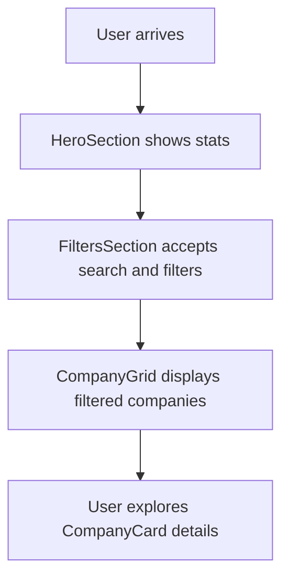

# Key Features at a Glance

Welcome to the snapshot view of Y Combinator Graveyard Stories' major features. This page distills the application's core capabilities, illustrating how you can seamlessly browse, filter, and explore the data of failed YC startups with an engaging, modern UI built on React, Vite, and shadcn-ui components.

---

## Overview

Y Combinator Graveyard Stories offers a rich, interactive experience designed to empower anyone curious about the journey and fate of YC companies that didn't make it. This "Key Features at a Glance" page highlights how users can efficiently navigate through extensive datasets, filter by meaningful categories and batches, visualize key statistics, and dive into detailed company profiles—all in a performant, user-friendly interface.

## Major Features Explained

### 1. Comprehensive Browsing of Failed Companies

- **What it does:** Presents a structured grid of companies that have shut down, with individual cards displaying concise company info and failure reasons.
- **User benefit:** Quickly scan through and identify companies of interest without overwhelming data clutter.
- **How it’s presented:** The grid updates dynamically based on filter selections and search terms, ensuring relevance.

### 2. Powerful Filtering and Search

- **Capabilities:** Allows filtering by company category and batch year, and searching by company name, descriptions, or shutdown reasons.
- **User intent:** Easily narrow down results to sectors, timeframes, or keywords that matter to your research or curiosity.
- **Intuitive UI:** Uses dropdown selects and a search input with placeholder prompts, making the filtering experience direct and accessible.

### 3. Visual Summaries of Dataset Metrics

- **Displayed statistics:** Total failed companies, total funding lost (formatted in billions for instant impact), and average lifespan of these companies.
- **Why it matters:** Users immediately grasp the scale and patterns of failure, providing context before deep diving.
- **Design approach:** Presented in a visually striking hero section with gradient backgrounds and clean typography.

### 4. Detailed Company Profiles in Cards

- **Card contents:** Include company name, batch, category, founding/shutdown years, funding raised, and the reason for shutdown.
- **Benefit:** Each card encapsulates the story essentials, saving users time while piquing interest for further exploration.
- **UI polish:** Cards feature hover effects and subtle shadows, enhancing engagement and readability.

### 5. Modern, Responsive UI Built With React Ecosystem

- **Technologies used:** React framework, Vite for fast bundling, and shadcn-ui for customizable, accessible UI components.
- **User impact:** Ensures a fast, fluid interface on desktop and mobile devices.
- **Accessibility consideration:** Interactive elements like dropdowns, inputs, and badges maintain clarity and usability across contexts.

## Practical User Flow

1. **Landing on the page,** you see a visual summary of failures instantly.
2. **Use the search box** to enter company names, failure reasons, or descriptions.
3. **Select filters** for category or batch to zero in on specific subsets.
4. **Browse the dynamically updated company grid** showing matching results.
5. **Examine individual company cards** for quick insight on why and when they failed.

## Tips and Best Practices

- Start broad with ‘All Categories’ and ‘All Batches’ to get an overview before narrowing down.
- Use multiple filters simultaneously to find patterns or clusters in failures.
- Leverage search for keywords related to causes or business models you want to examine.
- Notice the funding lost and lifespan metrics to contextualize failure impact over time.

## Common Pitfalls to Avoid

- **Empty searches:** If no companies appear, try broadening your search terms or resetting filters.
- **Over-filtering:** Applying too many restrictive filters might return no results; adjust filters progressively.
- **Ignoring filters:** Relying on search alone may miss batch or category insights.

## Next Steps

Ready to dive deeper? After mastering browsing and filtering here, explore detailed guides on:

- [Browsing YC Graveyard Stories](/guides/core-workflows/browse-companies) to understand navigation.
- [Filtering and Searching for Companies](/guides/core-workflows/filter-search) for advanced query techniques.
- [Understanding Company Shutdowns](/guides/core-workflows/reading-stories) to interpret failure insights.

---

Continue your learning journey to uncover the lessons hidden in these startup stories.

---

## Example Code Snippet: Filtering Companies

```typescript
const filteredCompanies = filterCompanies(searchTerm, selectedCategory, selectedBatch);
```

This simple API allows you to see only companies that matter to your current inquiry, seamlessly updating the display.

## Visual Summary



This flow represents the user path on this page from general overview to detailed exploration.
