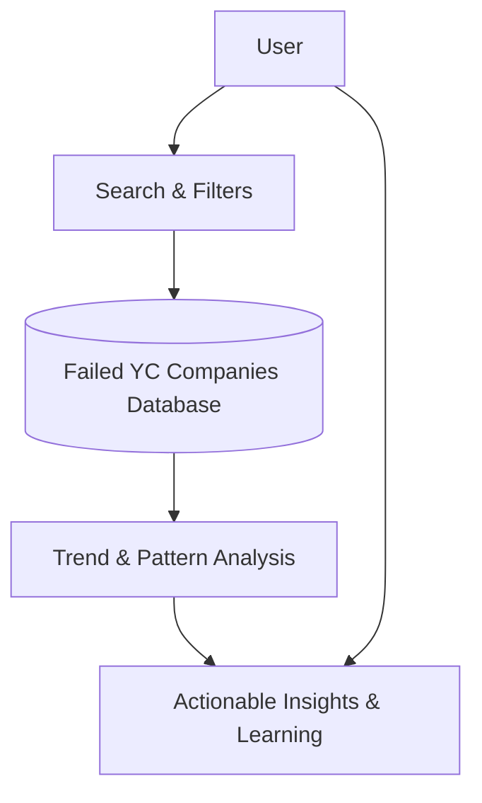

# Product Value & Typical Use Cases

## Unlocking Insight from YC Startup Failures

Y Combinator Graveyard Stories delivers a rare and invaluable window into the world of startup failures. By offering a curated, searchable database of failed YC companies from 2005 to 2025, this application transforms hindsight into actionable foresight. Whether you’re an entrepreneur, researcher, journalist, or investor, this platform equips you to identify patterns, avoid common pitfalls, and gain deep insights into why startups fail—and how to succeed where others didn't.

---

## Why This Data Matters

The value of studying failure is in learning from mistakes without making them yourself. YC Graveyard Stories isn’t just a list of dead companies; it’s a dynamic tool allowing you to:

- **Discover failure trends** across industries and batches, enabling informed decision-making.
- **Analyze reasons for shutdowns** linked to market shifts, competitor activity, funding challenges, or product-market fit failures.
- **Explore funding history and lifespan** to understand the trajectories behind each startup’s rise and fall.
- **Compare failure by startup categories**—from developer tools to social media—and grasp sector-specific risks.

By contextualizing these companies’ failures, you gain power to anticipate risks and pivot confidently in your own ventures.

---

## Who Uses YC Graveyard Stories and Why

### Entrepreneurs Seeking Market Signals
Before launching the next big idea, founders use the database to check if similar concepts have failed in the past—understanding the reasons behind those failures to build stronger, more resilient business models.

### Researchers and Academics
Studying failure patterns fuels academic research, offering empirical data for papers or case studies on startup dynamics, innovation diffusion, and ecosystem challenges.

### Journalists and Trend Analysts
Writers and analysts gain quick access to details about failed YC companies, helping them uncover trends or stories within the startup ecosystem and provide commentary grounded in data.

### Investors and Advisors
Knowledge of failed models informs better evaluation of new startups, allowing investors and advisors to spot red flags and undervalued opportunities.

---

## Typical Use Cases: Explore, Filter, Learn

### 1. Discover Industry-Wide Failure Patterns
Using interactive filters, you can isolate companies by category (e.g., Analytics, Social Media, Developer Tools) and examine collective funding lost, average lifespan, and common shutdown reasons. This reveals sector health and signals where heightened caution may be warranted.

### 2. Investigate Specific Batches
Analyze startups within particular YC batches to trace cohort behaviors and economic environments that correlated with higher failure rates. This perspective helps understand timing as a critical factor.

### 3. Perform Targeted Search Queries
Whether you want to know why "Backtype" shut down or find all failed companies raising over $10M in funding, the search function combines keywords across company names, descriptions, and failure reasons to bring relevant insights directly to you.

### 4. Compare Funding vs. Lifespan
Gain perspective on how financial resources impacted longevity. The dashboard highlights total funding lost as a collective figure, supported by average years active to frame investment risk and startup durability.

### Real-World Example
Imagine you’re considering launching a social media app. Searching by category "Social Media" reveals multiple failed startups with shutdown reasons citing competition from Facebook and Twitter. This insight informs your decision to identify clear differentiation or pivot before burning resources.

---

## What You Gain with This Page

- **Clarity on value**: Understand how YC Graveyard Stories unlocks strategic knowledge from failure.
- **Guided exploration**: Learn how to use filters and search to extract meaningful signals.
- **Practical context**: Study real data points such as funding lost, lifespan averages, and candid reasons behind shutdowns.

---

## Tips for Effective Use

- Use wide filters to spot broad trends, then narrow your search to deep-dive into specifics.
- Review reasons for failure carefully—they often contain nuanced lessons beyond simple cause-effect.
- Combine funding and timeline data to evaluate risk profiles for different startup categories.
- Cross-reference findings here with related sections like 'Who Should Use This Product?' to tailor your research approach.

---

## Troubleshooting Common Queries

<AccordionGroup title="Frequently Asked Questions">
<Accordion title="Why do some companies have unknown or vague shutdown reasons?">
Some shutdown reasons are user-sourced or summarized from anecdotal data, reflecting imperfect information. Use these insights qualitatively rather than as definitive causes.
</Accordion>
<Accordion title="Can I rely on this data for investment decisions?">
This application is a learning tool and not a financial advisory service. Use the failure data to inform risk awareness but combine it with broader due diligence.
</Accordion>
<Accordion title="How often is the data updated?">
Data currently spans YC batches from 2005 to 2025. Updates depend on new data availability and curation efforts.
</Accordion>
</AccordionGroup>

---

## Next Steps
To put this value into practice, visit the [Overview: What is Y Combinator Graveyard Stories?](/overview/getting-started-product/about-product) to ground your understanding. Then explore the [Who Should Use This Product?](/overview/getting-started-product/target-audience) guide to align the tool with your goals.

From here, start engaging with dynamic filters and searches on the main discovery page to uncover startup failure stories tailored to your interests.

---

## Explore More
- **Interactive Filters and Search**: Refine results by categories, batches, and keywords.
- **Company Profiles**: Dive into individual company cards showing founding and shutdown years, funding, reasons for failure, and more.
- **Dashboard Metrics**: Track aggregate numbers such as total failed companies, lost funding, and average lifespan.

---

## Summary Visualization

This flow depicts how users interact with the application by searching and filtering through the extensive database to gain insights about YC startup failures.

---

Understanding failure is your strongest advisor in building successful startups. YC Graveyard Stories puts this powerful perspective at your fingertips.

---

*For detailed product intro, visit the [About Product](../getting-started-product/about-product) page.*

---

## References
- YC Dead Companies Data Structure: `DeadCompany` interface including id, name, batch, year, description, reason, category, founded, shutdownYear, funding.
- UseCompanyData hook: provides filtering logic, category and batch lists, total funding, and average lifespan calculations.
- CompanyCard and CompanyGrid components: visualize individual and collections of dead companies with key info like failure reasons.

---

*© 2024 Y Combinator Graveyard Stories*