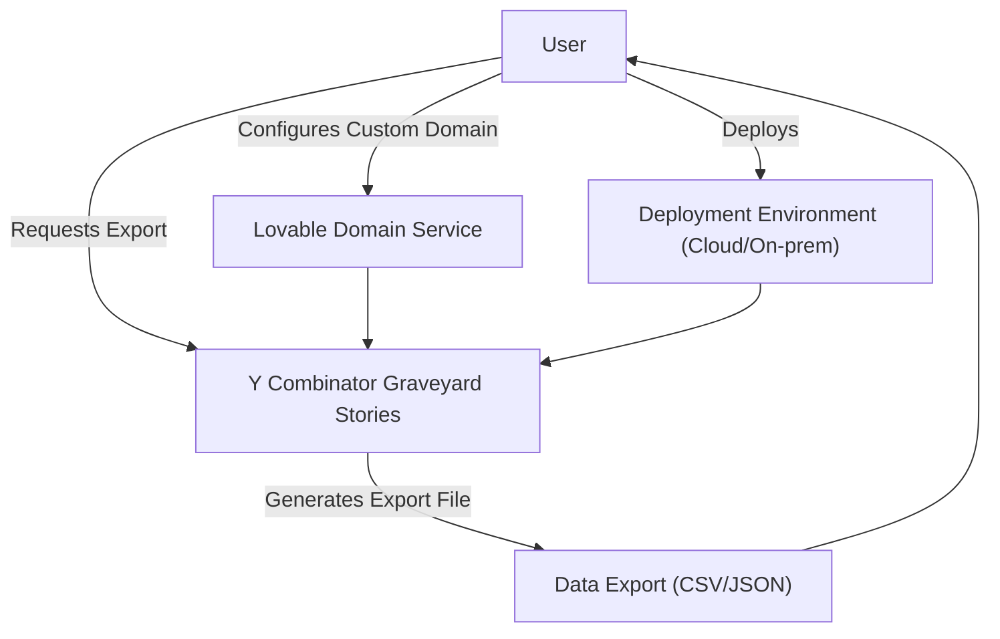

# Integration with Other Systems

Welcome to the Integration with Other Systems page. This section introduces you to the various ways you can extend the reach and impact of the Y Combinator Graveyard Stories application by connecting it with external tools and systems. Whether you want to export data, connect a custom domain, or deploy the app in diverse environments, you'll find clear guidance here to make these integrations seamless.

---

## Why Integrate?

Integrating Y Combinator Graveyard Stories with other systems allows you to embed its powerful insights into your broader workflows and data pipelines. By connecting to external platforms, you can:

- **Amplify your research:** Export curated data sets for advanced analysis.
- **Enhance accessibility:** Use your own custom domain for branding and easier access.
- **Customize deployment:** Tailor where and how the app runs to fit your infrastructure.

These options empower entrepreneurs, researchers, journalists, and investors to maximize the value of our unique database in ways that work best for them.

## Integration Points Overview

This page covers the following key integration capabilities:

### 1. Data Exports

You can export data from the app to incorporate into your own research or data processing workflows. Export formats focus on usability and compatibility, enabling you to analyze startup failure patterns offline or in your preferred tools.

**Example Use Case:** A researcher downloads batches of company shutdown data in CSV format to run custom statistical analyses or to feed ML models examining failure trends.

### 2. Custom Domains via Lovable

Using the Lovable integration, you can connect your own domain to host the application. This supports brand consistency and easier sharing within your team or audience.

**Benefits:**
- Personalized URL reflecting your brand.
- Seamless integration with your existing domain management system.

### 3. Deployment Environments

The app supports deployment to a variety of environments. This flexibility allows you to run the application on your preferred cloud provider or on-premises infrastructure, ensuring compliance and performance needs are met.

**Examples:** Hosting on AWS, DigitalOcean, or local servers.

## How It Works

The application exposes integration hooks without compromising its core user experience. Integration workflows are designed to be intuitive and require minimal configuration to get started.

### Integration Flow Example

This flow highlights how users interact with various integration points to extend app capabilities.

## Getting Started with Integrations

### Prerequisites

- Access to the application with appropriate permissions for export and configuration
- Domain ownership or control when configuring custom domains
- Basic familiarity with your deployment environment

### Step-by-Step

1. **Exporting Data:**
   - Navigate to the export section within the app
   - Select desired data filters (e.g., by batch, category)
   - Choose export format (CSV/JSON)
   - Download the file and import it into your analytics or reporting tool

2. **Connecting a Custom Domain via Lovable:**
   - Register your domain with Lovable
   - Follow the guided domain linking process offered by Lovable in the app
   - Verify DNS settings with your domain registrar
   - Access the app via your custom URL

3. **Deploying to Your Environment:**
   - Clone the repository from GitHub: [Y Combinator Graveyard Stories GitHub](https://github.com/modelorona/ycombinator-graveyard-stories)
   - Follow deployment instructions for your chosen environment (refer to your platform’s documentation for specifics)
   - Configure any environment variables, API keys, or custom settings as required

## Best Practices and Tips

- **Verify Export Integrity:** Always check exported data files for completeness and accuracy after download.

- **Domain Configuration:** DNS propagation can take some time; plan accordingly when switching to a custom domain.

- **Secure Deployment:** When deploying externally, ensure your environment follows security best practices to protect sensitive data.

- **Regular Updates:** Keep the app and its dependencies up to date to benefit from improvements and security patches.

## Troubleshooting Common Issues

<AccordionGroup title="Integration Troubleshooting">
<Accordion title="Data Export Issues">
- Ensure you have selected valid filters before exporting.
- Check for network connectivity if export fails or stalls.
- Confirm your browser supports the download formats.
</Accordion>
<Accordion title="Custom Domain Not Resolving">
- Verify DNS records are properly set with your registrar.
- Allow up to 48 hours for DNS changes to propagate.
- Use domain diagnostic tools (like `dig` or online checkers) to troubleshoot.
</Accordion>
<Accordion title="Deployment Problems">
- Review environment logs for error messages.
- Confirm environment variables and dependencies are correctly configured.
- Verify the app version matches deployment instructions.
</Accordion>
</AccordionGroup>

---

## Additional Resources

- [Prerequisites & System Requirements](/getting-started/setup-installation/prerequisites): Ensure your system is ready for integrations.
- [Installation Methods](/getting-started/setup-installation/installation-methods): Learn how to install the app for custom deployments.
- [Core Concepts & Terminology](/overview/architecture-core-concepts/core-concepts-terminology): Understand key terms that apply to integration data.
- [System Architecture](/overview/architecture-core-concepts/system-architecture): See how integration components fit into the overall app.

---

By mastering these integration options, you can customize and extend Y Combinator Graveyard Stories to better fit your research, branding, and infrastructure needs. Start exploring data exports, domain connections, and deployment strategies to unlock the full potential of the platform within your ecosystem.

---

*For further assistance or feature requests, please refer to the GitHub repository or contact support.*

---